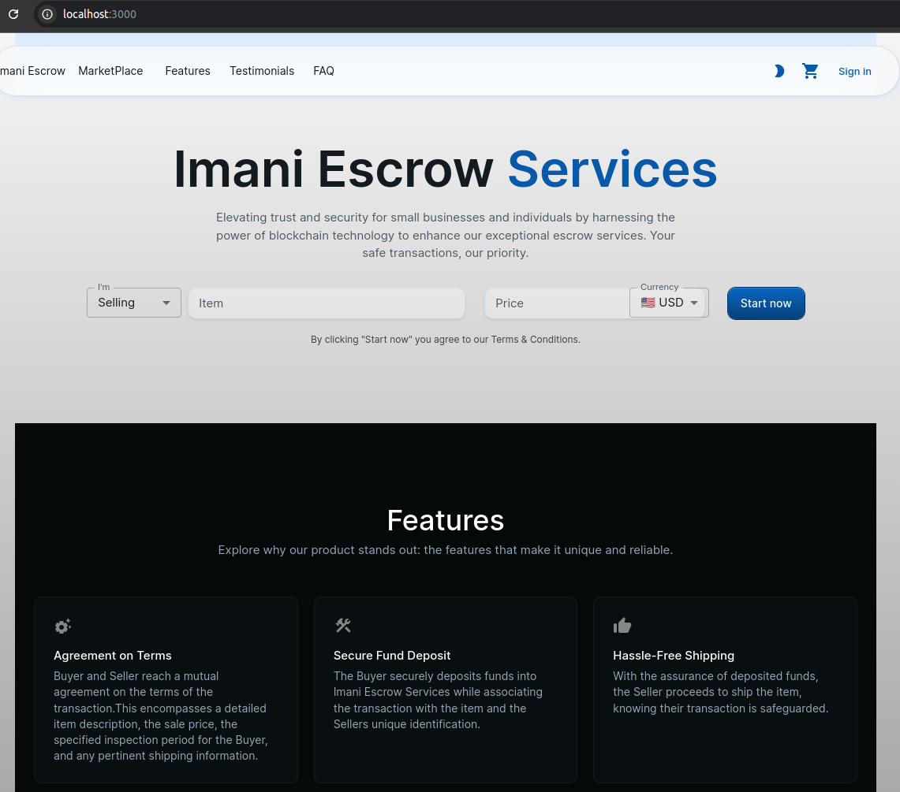
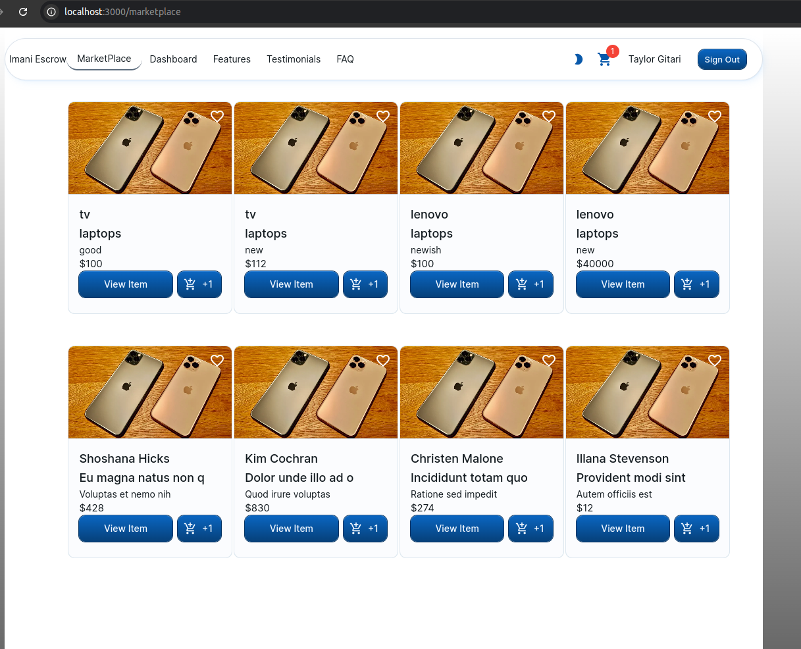
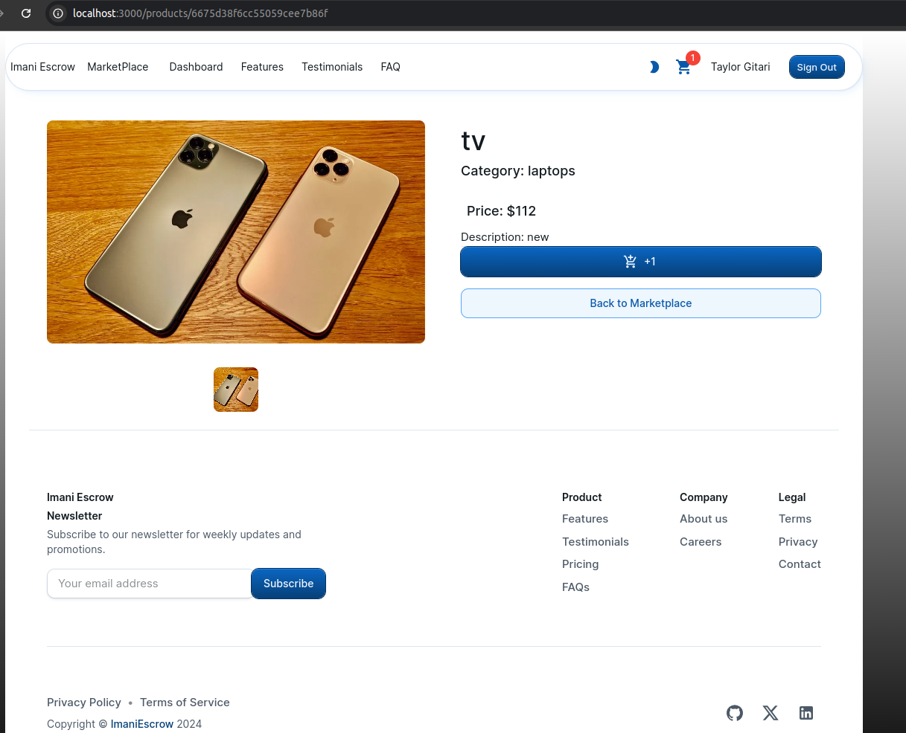
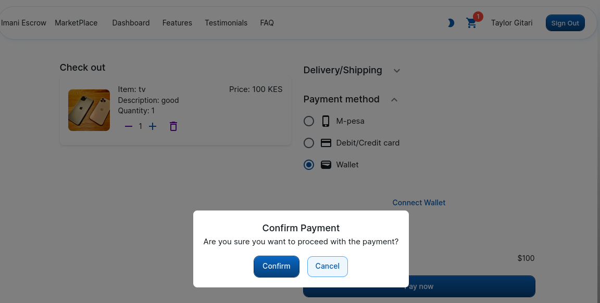
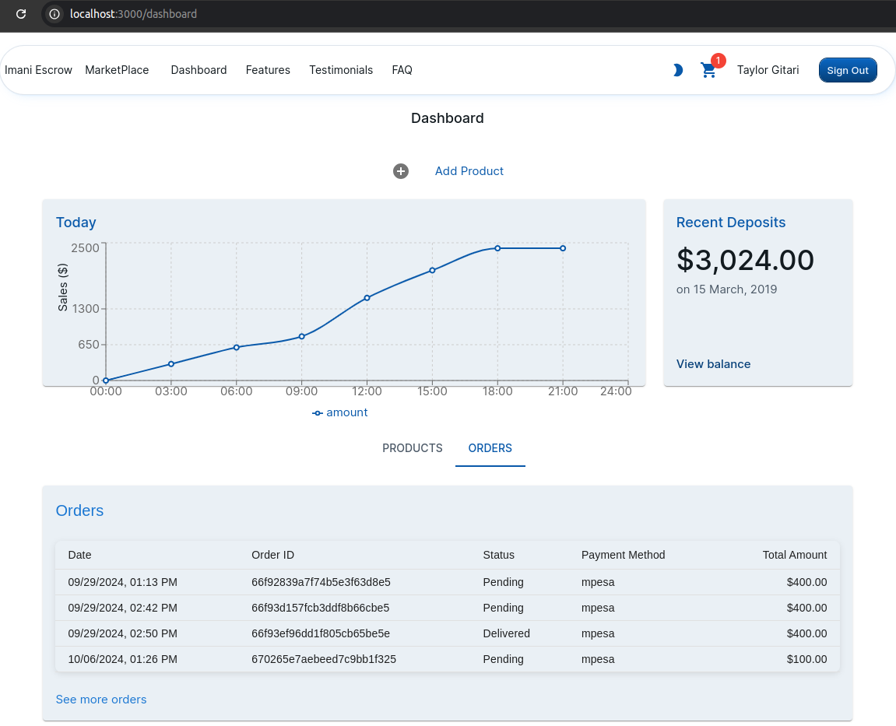
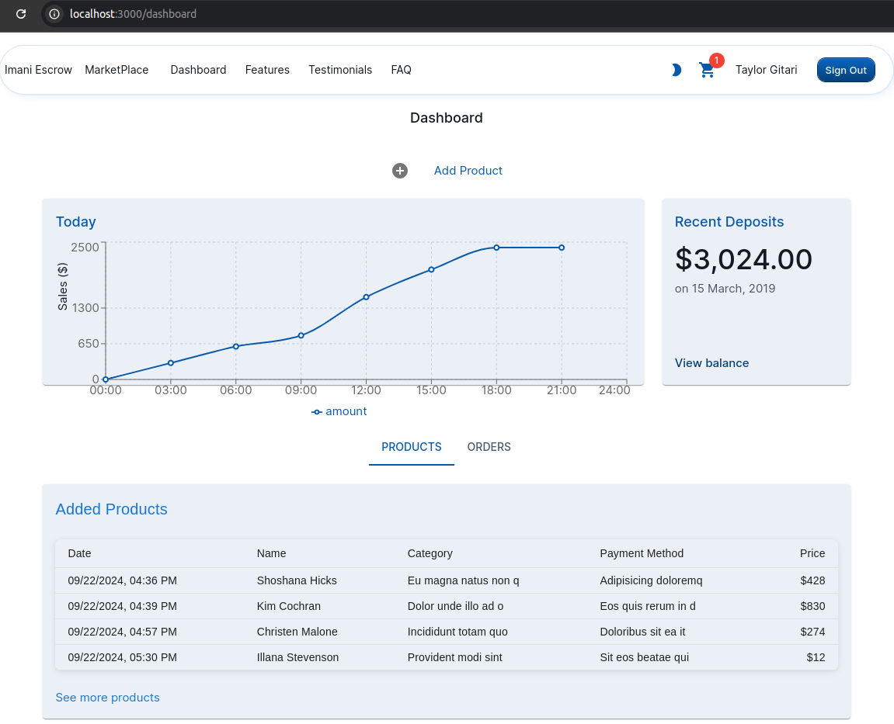
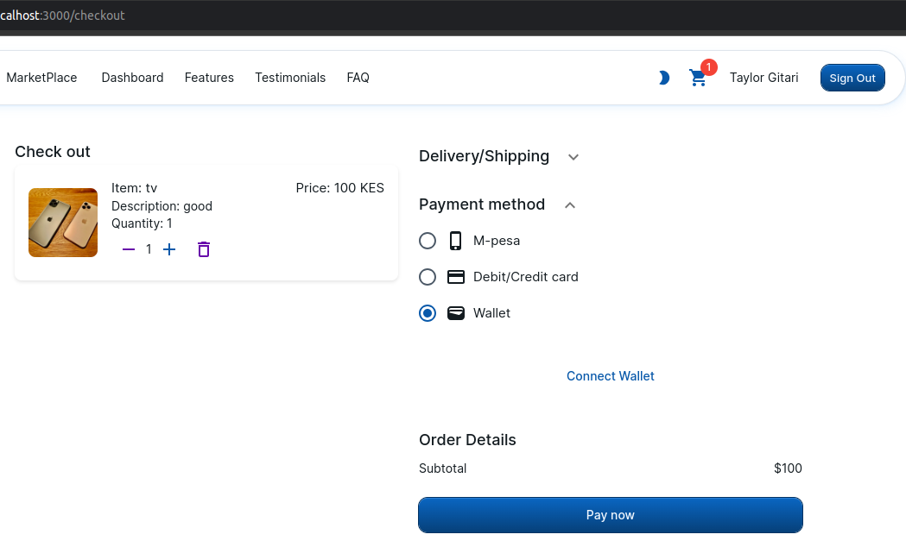
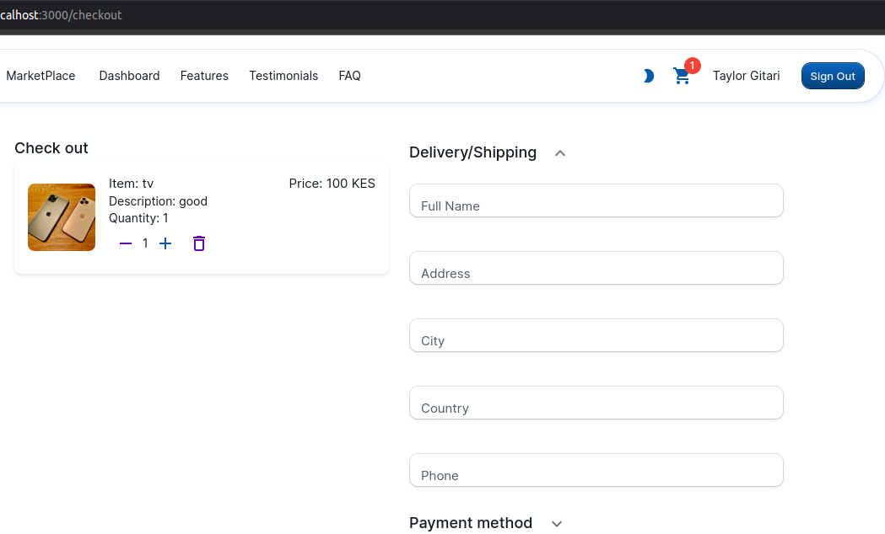
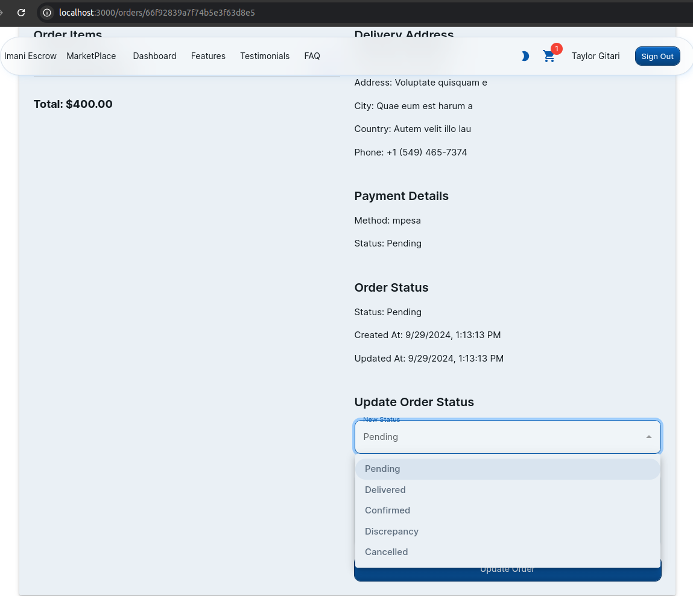

# Imani Escrow

Welcome to **Imani Escrow** – your trusted partner in navigating the world of online shopping! 🚀

## Summary

Imani Escrow is an innovative e-commerce platform designed to protect both buyers and sellers through a seamless escrow mechanism. Built using Next.js, Solidity, and the Ethers.js library, our platform allows users to browse, buy, and sell products while ensuring a secure transaction experience.

## Overview

In today's digital marketplace, trust is essential. Imani Escrow bridges the gap between buyers and sellers, ensuring that every transaction is safeguarded. Here’s how it works:

- **Browse the Marketplace:** Buyers can explore a diverse range of products listed by registered sellers.
- **Secure Payments:** By integrating WalletConnect using the Fuel SDK, users can connect their wallets and make cryptocurrency payments directly to the platform's escrow account.
- **Transaction Confirmation:** Once a buyer receives their product, they can confirm the transaction on their dashboard. The agreed amount, minus escrow fees, is then released to the seller.
- **User Dashboards:** Both buyers and sellers have access to their personal dashboards, where they can track orders and manage product listings.

## Features

- **User-friendly Interface:** Navigate effortlessly through the marketplace.
- **Secure Escrow Transactions:** Protection for both buyers and sellers through an automated escrow process.
- **Crypto Payments:** Easily connect your wallet and pay using cryptocurrencies.
- **Dashboard Management:** Convenient dashboards for tracking orders and managing listings.

## Demo Images











## Getting Started

To get started with Imani Escrow, follow these simple steps:

1. **Clone the Repository:**

   ```bash
   git clone https://github.com/taye000/imani-escrow.git
   cd imani-escrow

2. **Install Dependencies:**
    yarn
    Run the Application:

3. **Run the Application:**
    yarn dev
    Visit the App: Open your browser and navigate to http://localhost:3000.

## Contributing
We welcome contributions! If you have suggestions for improvements or want to report issues, please feel free to submit a pull request or open an issue.

## License
This project is licensed under the MIT License.

## Acknowledgments
A big shoutout to the developers and teams behind the tools and libraries that made this project possible!